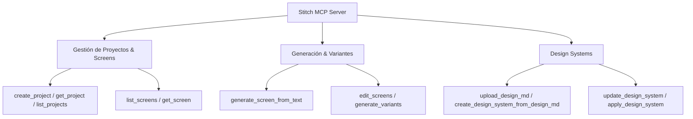

# Manual de Skills MCP, Prompts y Jerarquía Markdown — One Piece: Eternal

Este documento constituye la **guía maestra de referencia** sobre todas las herramientas MCP (Model Context Protocol), skills personalizadas, prompts de diseño (Frontend, Backend, Historia/Lore), la jerarquía de documentación `.md` y los **textos e instrucciones íntegras de cada archivo `.md` de reglas** que rigen el proyecto **One Piece: Eternal**.

---

## 1. Catálogo Completo de Herramientas y Skills MCP

El entorno de ejecución dispone de un conjunto integrado de herramientas nativas (Eager Tools), herramientas MCP bajo demanda (Lazy Tools via `stitch`) y skills personalizadas por repositorio (`.agents/skills/`).

### 1.1. Herramientas MCP Nativas y Eager Tools

| Herramienta | Descripción y Uso | Ámbito de Aplicación |
|---|---|---|
| `run_command` | Propone y ejecuta comandos PowerShell en el sistema. *Nota: Usar `;` como separador de comandos, nunca `&&`.* | Compilación, tests, sincronización de temas (`sync-theme.php`), consultas graphify. |
| `view_file` | Lectura de archivos locales (soporta texto, imágenes, PDF, vídeo, audio). Permite rangos de líneas. | Inspección de código PHP, CSS, XML o documentación. |
| `replace_file_content` | Edición de un bloque contiguo de texto dentro de un archivo existente. | Modificación de funciones, reglas CSS o plantillas. |
| `multi_replace_file_content` | Edición de múltiples bloques no contiguos en un mismo archivo en una sola operación atómica. | Refactorización de múltiples métodos o variables en un mismo archivo. |
| `write_to_file` | Creación de nuevos archivos en el sistema de archivos (o sobrescritura con bandera `Overwrite`). | Creación de nuevos scripts PHP, documentación MD o componentes. |
| `list_dir` | Lista los archivos y subdirectorios de una ruta absoluta. | Exploración de la estructura del proyecto. |
| `grep_search` | Búsqueda por expresiones regulares o texto exacto usando Ripgrep a alta velocidad. | Búsqueda de símbolos (`ope_`), funciones, clases o selectores CSS. |
| `browser_subagent` | Subagente de navegación web con control total de navegador (Playwright/Chrome) y grabación de vídeo WebP. | Pruebas UI end-to-end, comparación visual y captura de pantalla. |
| `generate_image` | Generador de imágenes y mockups por IA a partir de prompts textuales o edición de imágenes. | Creación de assets de juego, avatares, ilustraciones de islas o maquetas UI. |
| `search_web` / `read_url_content` | Búsqueda en la web e inspección de contenido de páginas web en formato Markdown. | Investigación de documentación MyBB, referencias de One Piece o CSS. |
| `schedule` | Programador de temporizadores y tareas recurrentes (Cron) en segundo plano. | Recordatorios de compilación o monitorización de procesos largos. |
| `manage_task` | Control y gestión de procesos en segundo plano (`list`, `kill`, `status`, `send_input`). | Gestión de servidores dev o scripts de larga duración. |
| `ask_question` / `ask_permission` | Formulario de preguntas multiopción interactivo y solicitud de permisos del sistema. | Aclaración de decisiones de diseño o permisos de archivos. |

---

### 1.2. Servidor MCP `stitch` (Diseño UI & Design Systems)

El servidor `stitch` provee herramientas avanzadas para la creación y gestión de interfaces de usuario y sistemas de diseño:



- **`generate_screen_from_text`**: Crea pantallas UI completas a partir de descripciones funcionales.
- **`generate_variants`**: Genera variaciones estilísticas (modo oscuro, acuarela, alternativas de disposición).
- **`upload_design_md` / `create_design_system_from_design_md`**: Convierte guías de diseño en Markdown (como `DESIGN-ONE-PIECE-ETERNAL.md`) en tokens reutilizables y reglas de estilo.
- **`apply_design_system`**: Aplica un sistema de diseño estructurado a pantallas existentes para mantener coherencia visual.

---

### 1.3. Skills Personalizadas del Repositorio (`.agents/skills/`)

Ubicadas en `.agents/skills/` dentro de `Eternal-RPG`, estas habilidades definen el comportamiento especializado para el proyecto:

1. **`frontend-design`**:
   - **Propósito**: Guía para la creación de interfaces de usuario premium con estética acuarela/marítima adaptada a One Piece: Eternal.
   - **Reglas clave**: Scoping CSS estricto con `body.ope-pg-<pagina>`, paleta HSL acuarela (`--line`, `--bg-plate`, `--accent-gold`), microanimaciones, cero brutalismo legacy de bordes negros 2px.

2. **`mybb-plugin-dev`**:
   - **Propósito**: Arquitectura del plugin `ope_rol` en `inc/ope_rol/`.
   - **Reglas clave**: Modularización en capas (`core/`, `catalogos/`, `dominio/`, `sistemas/`, `mundo/`, `tramites/`). Prefijo obligatorio `ope_` en PHP. Manejo de hooks de MyBB y compatibilidad con stubs.

3. **`mybb-theme-dev`**:
   - **Propósito**: Gestión del tema visual de MyBB.
   - **Reglas clave**: El archivo CSS canónico es `docs/themes/ope.css`. Sincronización obligatoria mediante `php scripts/sync-theme.php import` y verificación `verify`. Auditoría con `check-inline-styles.php`.

4. **`graphify`**:
   - **Propósito**: Navegación por el grafo de conocimiento AST del código del foro.
   - **Reglas clave**: Ejecución de consultas `py -m graphify query "<pregunta>"` y actualización incremental `py -m graphify update .` tras modificar código PHP.

5. **`impeccable`**:
   - **Propósito**: Garantía de calidad en el portado visual y paridad de 5 capas (Estructura, Tokens, Overrides OP, Fuentes, Datos).
   - **Reglas clave**: Prohibido declarar una tarea completada sin verificación visual directa en navegador e inspección de contraste/accesibilidad.

6. **`web-reference`**:
   - **Propósito**: Extracción y análisis de prototipos HTML/CSS ubicados en `docs/Prototypes/`.

---

## 2. Prompts de Diseño y Directivas por Capa

### 2.1. Frontend & UI/UX Design Prompts

#### Prompt de Arranque UI (Copiar al iniciar tareas visuales):
```text
Proyecto One Piece: Eternal — Foro MyBB + PHP en Eternal-RPG
OBLIGATORIO antes de escribir código UI:
1. Leer AGENTS.md y docs/AGENTES-Y-HERRAMIENTAS.md.
2. Portado visual = 5 capas completas (Estructura, Tokens, Overrides OP, Fuentes, Datos). NUNCA un componente aislado.
3. Fuente de verdad visual: docs/DESIGN-ONE-PIECE-ETERNAL.md
4. Prototipo de referencia: docs/Prototypes/Granblue/index.html

Reglas de CSS:
- Scoping estricto bajo `body.ope-pg-<slug>` (o `body.ope-index` para portada).
- Prohibido <style> y style="..." estáticos en HTML/PHP.
- Sincronización obligatoria tras editar CSS:
    php scripts/sync-theme.php import
    php scripts/sync-theme.php verify
    php scripts/check-inline-styles.php

Estética: Modern UI con toques náuticos acuarela, bordes suavizados (border-radius: 8px), vidrio traslúcido (glassmorphism), tipografía moderna (Google Fonts) y degradados elegantes. Prohibido el estilo brutalista con bordes negros pesados.
```

#### Reglas de Estética Visual y Scoping:
- **Tokens Canónicos**: Usar exclusivamente la paleta HSL definida en `docs/themes/ope.css`.
- **Botones**: Formularios y acciones principales deben ser rectangulares con `border-radius: 8px` (estilo pill prohibido en portada index).
- **Scaffold Obligatorio**: Ninguna clase (.plate, .shead, .reveal) puede usarse suelta sin el wrapper del scope correspondiente.

---

### 2.2. Backend & Arquitectura PHP Prompts

#### Prompt de Desarrollo Backend (`ope_rol`):
```text
Desarrollo Backend para One Piece: Eternal
Arquitectura: Plugin `ope_rol` ubicado en `inc/ope_rol/` (entrada bootstrap.php).

Capas del Backend:
- `core/`: Configuración, carga de hooks, utilidades base del sistema.
- `catalogos/`: Tablas maestras (Razas, Estilos de Combate, Akuma no Mi, Haki, Oficios).
- `dominio/`: Entidades del jugador (Fichas, Atributos, Inventario, Tripulaciones).
- `sistemas/`: Motores de cálculo (Dados, Combate PBP, Recompensas, Experiencia).
- `mundo/`: Navegación (Islas, Mares, Clima, Rutas, Posición actual).
- `tramites/`: Gestión de solicitudes (Aprobaciones de Ficha, Peticiones Staff).

Reglas de Código:
- Prefijo de funciones y clases: `ope_` (PHP).
- Prohibido reintroducir prefijos legacy (`gbe_`, Granblue, GBF, I-Forge).
- Modificaciones en base de datos deben usar transacciones MyBB y sanitización DB `$db->escape_string()`.
- Tras cambios estructurales en PHP, ejecutar `py -m graphify update .` para mantener el grafo AST al día.
```

---

### 2.3. Historia, Lore & Worldbuilding Prompts

#### Prompt de Creación de Contenido Lore & RPG:
```text
Diseño de Lore y Contenido Narrativo para One Piece: Eternal
Repositorio de referencia: `Eternal-Lore/` e `Eternal-Sistema/`.

Estructura Narrativa Exigida:
1. Coherencia Canonical-Eternal: Respetar la era del juego (tras la Ejecución de Roger / Gran Era Pirata o línea temporal propia del foro).
2. Facciones & Clima Político: Interacción entre Marina, Gobierno Mundial, Cuatro Emperadores, Ejército Revolucionario y Piratas del Mar.
3. Fichas de Isla/Lugar:
   - Nombre de la Isla y Mar (East Blue, West Blue, Grand Line, New World).
   - Log Pose / Tiempo de Carga.
   - Nivel de Peligrosidad (Rango D a S+).
   - Ficción y Geografía: Clima, relieve, pueblos clave.
   - Historia y Eventos Recientes (Periódicos / Gaceta).
   - Recursos, Fauna (Bestiario) y NPC Mayores presentes.
4. Integración de Sistemas: Cada entidad de lore (Akuma no Mi, Estilo, Objeto) debe vinculación con un catálogo PHP en `inc/ope_rol/catalogos/`.
```

---

## 3. Jerarquía y Estructura de Documentación Markdown (`.md`)

El ecosistema de documentación de One Piece: Eternal se organiza de manera jerárquica para mantener la separación clara entre **reglas de agentes**, **diseño visual**, **arquitectura de software** y **lore del universo**.

```mermaid
graph TD
    Root[Raíz del Proyecto] --> AGENTS[AGENTS.md - Reglas Globales de Agente]
    Root --> RPG[Eternal-RPG / Foros & Backend]
    Root --> LORE[Eternal-Lore / Historia & Mundo]
    Root --> SISTEMA[Eternal-Sistema / Reglas de Juego PBP]

    RPG --> RPG_DOCS[docs/]
    RPG_DOCS --> ANTIGRAVITY[ANTIGRAVITY.md - Prompt Arranque IDE]
    RPG_DOCS --> DESIGN[DESIGN-ONE-PIECE-ETERNAL.md - Fuente Visual]
    RPG_DOCS --> AGENT_TOOLS[AGENTES-Y-HERRAMIENTAS.md - Protocolo Paridad]
    RPG_DOCS --> PHP_STYLE[GUIA-ESTILOS-PHP.md - Scaffolding PHP]
    RPG_DOCS --> PLAN_MAESTRO[PLAN-MAESTRO-ONE-PIECE-ETERNAL.md]
    RPG_DOCS --> PRODUCT[PRODUCT.md - Visión del Foro]

    RPG --> SKILLS[.agents/skills/]
    SKILLS --> SKILL_FRONT[frontend-design/SKILL.md]
    SKILLS --> SKILL_PLUGIN[mybb-plugin-dev/SKILL.md]
    SKILLS --> SKILL_THEME[mybb-theme-dev/SKILL.md]
    SKILLS --> SKILL_GRAPH[graphify/SKILL.md]

    LORE --> LORE_CRONO[Cronologia/ - Línea del tiempo]
    LORE --> LORE_FAC[Facciones/ - Marinos, Piratas, Revs]
    LORE --> LORE_ISLA[Islas/ - Fichas de Islas y Mares]
    LORE --> LORE_NPC[NPC_Mayores/ - Personajes clave del mundo]
    LORE --> LORE_PER[Periodicos/ - Gacetas y noticias in-game]
```



---

## 4. Prompts e Instrucciones Íntegras de los Archivos `.md` del Proyecto

A continuación se incluyen los **textos exactos e íntegros** de cada archivo `.md` de reglas del proyecto que siguen los agentes de IA (Cursor, OpenCode y Antigravity):

### 4.1. Textos e Instrucciones de `AGENTS.md` (Raíz del proyecto)

```markdown
# Instrucciones para agentes — One Piece: Eternal

> **Documentación de sistemas (reglas de juego):** repo hermano `Eternal-Sistema/docs/` (Haki, Frutas, Eternal, Combate…).  
> **Documentación de este foro (código MyBB):** `docs/` aquí.  
> Plan de implementación: `Eternal-Sistema/docs/10-AUTOMATISMOS/PLAN-IMPLEMENTACION-MYBB.md`.

---

## graphify

Este proyecto tiene un grafo de conocimiento en `graphify-out/`.

Cuando el usuario escribe `/graphify`, usa el skill graphify antes de cualquier otra cosa.

Reglas:
- Para preguntas sobre el código, ejecuta primero `py -m graphify query "<pregunta>"` si existe `graphify-out/graph.json`. Usa `py -m graphify path "<A>" "<B>"` para relaciones y `py -m graphify explain "<concepto>"` para conceptos.
- Los archivos sucios en `graphify-out/` tras hooks o updates incrementales son normales; no omitas graphify por eso.
- Si existe `graphify-out/wiki/index.md`, úsalo para navegar en lugar de leer fuentes a ciegas.
- Lee `graphify-out/GRAPH_REPORT.md` solo para revisión amplia de arquitectura.
- Tras modificar código: `py -m graphify update .` (AST, sin coste API).

---

## Marca y codename

- **Producto:** One Piece: Eternal
- **Prefijo de código:** `ope_` (funciones PHP), `ope-` (CSS / plantillas)
- **Plugin:** `inc/plugins/ope_rol.php` (codename `ope_rol`)
- **Backend:** `inc/ope_rol/` (capas: `core/`, `catalogos/`, `dominio/`, `sistemas/`, `mundo/`, `tramites/`) — entrada `inc/ope_rol/bootstrap.php`. Stubs en `inc/ope_rol_*.php` para compatibilidad.
- **CSS canónico:** `docs/themes/ope.css` → sync a MyBB con `php scripts/sync-theme.php import`
- **Prohibido** reintroducir `gbe_`, `gbe-`, Granblue, GBF, I-Forge o iforge en código nuevo

---

## Páginas PHP y CSS

Fuente de verdad visual: **`docs/DESIGN-ONE-PIECE-ETERNAL.md`** (si existe) y `docs/GUIA-ESTILOS-PHP.md`.

Reglas que NO se pueden saltar:
- Las clases **`.shead .plate .plate-h .plate-b .reveal .flash .pj-empty` NO son globales**: se re-declaran por scope `body.ope-pg-<pagina>` (o `ope-pg-*`). Sin scaffolding → texto plano.
- **Nuevas páginas:** scaffolding con tokens claros (`--line`, `border-radius`) — no brutalismo legacy.
- Prohibido `<style>` y `style="..."` estáticos; solo `style` dinámico de PHP.
- El navegador sirve `cache/themes/theme13/ope.css` (tras sync). Tras editar CSS: `php scripts/sync-theme.php import` y `verify`.
- Antes de terminar: `check-inline-styles` limpio + `OK CSS: in sync` + comparación visual en navegador.

### Portada MyBB

No usa `body.ope-pg-*`. Usa **`body.ope-index`**.
**Botones:** rectangulares `border-radius: 8px` — prohibido pill.

---

## Documentación obligatoria por tarea

| Tarea | Leer primero |
|---|---|
| Sistemas / lore (reglas) | `Eternal-Sistema/docs/DIRECCION-LORE-Y-SISTEMAS.md` |
| UI / tema / portada | `docs/DESIGN-ONE-PIECE-ETERNAL.md`, `docs/themes/README.md` |
| Página PHP nueva | DESIGN + `docs/GUIA-ESTILOS-PHP.md` + `.cursor/rules/page-scaffold.mdc` |
| Producto / copy | `docs/PRODUCT.md` |
| Roadmap de implementación | `Eternal-Sistema/docs/10-AUTOMATISMOS/PLAN-IMPLEMENTACION-MYBB.md` |
| Tema MyBB / sync | `docs/themes/README.md` |
```

---

### 4.2. Textos e Instrucciones de `docs/ANTIGRAVITY.md` (Prompt para Gemini IDE)

```markdown
# Antigravity (Gemini IDE) — One Piece: Eternal

Antigravity **no** carga automáticamente las reglas de Cursor. Usa este documento para configurar sesiones de trabajo en el mismo repo.

---

## Contexto fijo recomendado

Adjunta o fija en cada sesión de UI/RPG:

| Archivo | Por qué |
|---|---|
| `AGENTS.md` | Reglas base del proyecto |
| `docs/AGENTES-Y-HERRAMIENTAS.md` | Protocolo anti-portado parcial (crítico) |
| `docs/DESIGN-ONE-PIECE-ETERNAL.md` | Fuente de verdad visual |
| `docs/Prototypes/Granblue/index.html` | Referencia portada (abrir en navegador) |

---

## Prompt de arranque (copiar al iniciar chat)

Proyecto One Piece: Eternal — foro MyBB + PHP en C:\Users\Fgonz\Documents\Proyectos\One Piece: Eternal

OBLIGATORIO antes de código UI:
- Leer AGENTS.md y docs/AGENTES-Y-HERRAMIENTAS.md
- Portado visual = 5 capas completas (estructura, tokens, overrides OP, fuentes, datos). NUNCA solo un componente.
- Fuente diseño: docs/DESIGN-ONE-PIECE-ETERNAL.md
- Prototipo portada: docs/Prototypes/Granblue/index.html v3.2

Tras editar CSS/plantillas:
  php scripts/sync-theme.php import
  php scripts/sync-theme.php verify   (OK CSS: in sync)
  php scripts/check-inline-styles.php

Explorar código: py -m graphify query "pregunta"  (grafo en graphify-out/)

PowerShell: separar comandos con ; no &&

No estilo One Piece brutalista. Tokens OPE claros/acuarela (Referencia Visual).
```

---

### 4.3. Textos e Instrucciones de `.cursor/rules/visual-port-ope.mdc` (Protocolo de Paridad)

```markdown
# Portado visual OPE — NO portes a medias

Fuente completa: **`docs/AGENTES-Y-HERRAMIENTAS.md`** §2–§3. Prototipos: `docs/Prototypes/Granblue/`.

## Regla de oro

Un prototipo aprobado = **sistema completo**. Copiar solo el hero/carrusel **no** es portar el index.

## Las 5 capas (todas obligatorias)

1. **Estructura** — XML/PHP: `body.ope-index`, secciones `.ope-section`, bento, wrappers
2. **Tokens** — `:root` / `--ope-*` en `ope.css`
3. **Overrides legacy** — bajo scope correcto, anular `.ope-panel`, `.ope-block-cat`, `#ope-navbar` OP
4. **Head/fuentes** — `ope_rol_head_base()` + `headerinclude` (Cinzel/Cormorant/Spectral)
5. **Datos** — `index.php` lore, títulos, slugs Cielo

## Antes de marcar done

php scripts/sync-theme.php import
php scripts/sync-theme.php verify    # OK CSS: in sync
php scripts/check-inline-styles.php

- Hard refresh navegador (`cache/themes/theme13/ope.css`)
- Comparar lado a lado con `docs/Prototypes/Granblue/index.html` (scroll completo)
```

---

### 4.4. Textos e Instrucciones de `docs/GUIA-ESTILOS-PHP.md`

```markdown
# Guía de Estilos para Nuevas Páginas PHP

Regla de oro: **CERO `<style>` y CERO `style=""` estáticos en PHP.** Todo el CSS va en `docs/themes/ope.css`.

## Checklist al crear una nueva página PHP

1. **Encabezado PHP:**
```php
<?php
define('IN_MYBB', 1);
define('THIS_SCRIPT', 'mi-pagina.php');
require_once './global.php';
require_once MYBB_ROOT . 'inc/ope_rol_data.php';

$bburl    = htmlspecialchars_uni($mybb->settings['bburl']);
$bbname   = htmlspecialchars_uni($mybb->settings['bbname']);
$loggedin = (int)($mybb->user['uid'] ?? 0) > 0;
```

2. **Estructura HTML:** `<body class="ope-pg-mi-pagina">` (scope obligatorio).
3. **Scaffolding CSS en `ope.css`:**
```css
body.ope-pg-mi-pagina .shead { display:flex; align-items:baseline; gap:14px; margin:8px 0 14px; }
body.ope-pg-mi-pagina .plate { border:1px solid var(--line); background:var(--iron-plate); border-radius:14px; }
```
4. **Verificación:**
```bash
php scripts/check-inline-styles.php
php scripts/sync-theme.php import
php scripts/sync-theme.php verify
```
```

---

### 4.5. Textos e Instrucciones de `docs/PRODUCT.md` (Visión y Marca)

```markdown
# Product — One Piece: Eternal

## Brand Personality
Luminoso, épico, acuarela-sobre-nubes. Nunca infantil saturado ni corporativo genérico.

- **Voz:** cronista del Gremio — elegante, evocadora, con urgencia de aventura.
- **Tono:** serio pero esperanzador.
- **Copy:** verbos de navegación (zarpar, explorar, sellar, reclamar).

## Anti-references
- No neobrutalismo OP (bordes negros 2px, sombras duras, Big Shoulders Display)
- No glassmorphism genérico ni Bootstrap azul
- **No botones pill/cápsula** (`border-radius` > 12px en CTAs) — usar rectangulares 8px
- No copiar personajes canónicos de One Piece (universo reconocible + historia propia)
```

---

## 5. Prompts y Estructuras de Artefactos de Sistema (`implementation_plan.md` y `walkthrough.md`)

Cuando el agente opera en **Planning Mode**, sigue estrictamente estas plantillas en Markdown:

### 5.1. Prompt & Estructura para `implementation_plan.md`

```markdown
# [Descripción del Objetivo]

Breve resumen del problema, contexto del proyecto y qué se pretende lograr.

## User Review Required
> [!IMPORTANT]
> Cambios de arquitectura, breaking cambios o decisiones clave que requieren confirmación.

## Open Questions
> [!WARNING]
> Preguntas aclaratorias de diseño que el usuario debe validar.

## Proposed Changes

### [Componente / Módulo]
- #### [MODIFY] [nombre-archivo](file:///ruta/absoluta)
- #### [NEW] [nombre-archivo](file:///ruta/absoluta)
- #### [DELETE] [nombre-archivo](file:///ruta/absoluta)

## Verification Plan

### Automated Tests
- Comandos de prueba o compilación (ej. `php scripts/sync-theme.php verify`).

### Manual Verification
- Pasos de comprobación visual en el navegador mediante `browser_subagent`.
```

---

### 5.2. Prompt & Estructura para `walkthrough.md`

```markdown
# Walkthrough - [Nombre de la Tarea]

Resumen claro de lo que se ha construido, modificado y validado.

## Cambios Realizados

### Backend / PHP
- Explicación de cambios en `inc/ope_rol/`.

### Frontend / CSS
- Explicación de estilos agregados a `docs/themes/ope.css` bajo el scope correspondiente.

## Resultados de Verificación

- [x] Comprobación de sintaxis y estilos limpios: `php scripts/check-inline-styles.php` (PASADO)
- [x] Sincronización de tema: `php scripts/sync-theme.php verify` (OK CSS: in sync)

## Evidencia Visual


```

---

## 6. Resumen de Buenas Prácticas Inviolables

1. **Nunca asumir lógica ni rutas de archivo**: Comprobar siempre mediante `view_file` o `grep_search`.
2. **Inspección empírica de errores**: Leer el log de error completo antes de proponer diagnósticos.
3. **No realizar parches superficiales**: Prohibido silenciar excepciones o devolver fallbacks vacíos.
4. **Verificación runtime obligatoria**: Prohibido dar por terminada una tarea sin haber ejecutado los scripts de compilación, sintaxis o comprobación de sincronización (`sync-theme.php`).
5. **Comandos PowerShell**: Usar siempre `;` para encadenar comandos (`cd path; php script.php`), nunca `&&`.

---
*Manual generado y sincronizado para el proyecto One Piece: Eternal.*
