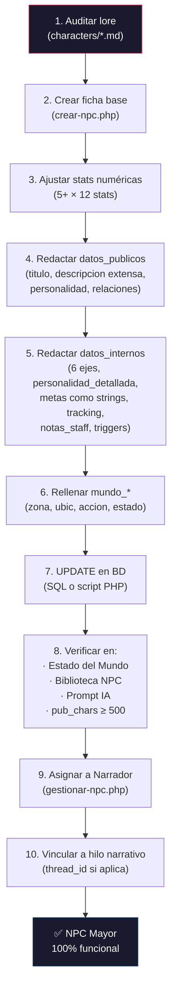

# Guía Definitiva de NPCs Mayores — One Piece Eternal · I-Forge (v2)

> **Propósito:** Cómo tomar cualquier NPC del lore y convertirlo en un **NPC Mayor completamente funcional** en el sistema. Todas las descripciones son extensas y detalladas porque alimentan directamente el prompt de la IA del Mundo Vivo.
>
> **Ejemplo guía:** **Isabella D. Vega — "La Reina Pirata"** en todos los pasos.

---

## 0. Cómo funciona realmente el sistema (lo que hay que saber antes de empezar)

### NPCs y personajes son lo mismo en BD

Los NPCs se almacenan en la **misma tabla** `mybb_rol_personajes` que los personajes jugadores. La única diferencia es que un NPC tiene `es_npc = 1`. El wizard `crear-npc.php` es prácticamente idéntico a `crear-personaje.php` salvo dos cosas:
- El NPC se crea con `uid = 0` (sin dueño) y `estado = 'aprobado'` (sin revisión).
- Después se asigna a una cuenta de Narrador desde `gestionar-npc.php`.

Esto significa que todo lo que un personaje tiene en BD, un NPC también puede tenerlo. Pero además, los NPCs Mayores necesitan **campos adicionales** que los personajes jugadores no usan.

### Las stats son numéricas (enteros, base 5, sin tope práctico)

El sistema usa **12 stats numéricas** agrupadas en 3 pilares. Cada stat arranca en **5** y crece repartiendo Puntos de Stat (PS ganados al rolear). No hay tope máximo práctico (los costes de subida escalan, pero valores de 80-100+ son alcanzables). Se almacenan como JSON numérico en `stats_json` y también en `datos.stats_efectivas`:

| Pilar | Stat | Sigla |
|---|---|---|
| **Cuerpo** | Fuerza | FUE |
| | Destreza | DES |
| | Vigor | VIG |
| | Agilidad | AGI |
| **Mente** | Intelecto | INT |
| | Ingenio | ING |
| | Concentración | CON |
| | Percepción | PER |
| **Espíritu** | Carisma | CAR |
| | Control | CTR |
| | Voluntad | VOL |
| | Sensibilidad | SEN |

La **suma de las 12 stats** dividida entre 10 determina el **nivel** del personaje: `nivel = floor(suma / 10)`. El nivel se traduce a una etiqueta según `ope_rol_nivel_label()`:

| Nivel | Etiqueta |
|---|---|
| 0-8 | Civil |
| 9-14 | Novato |
| 15-24 | Oficial |
| 25-39 | Capitán |
| 40-59 | Vicealmirante |
| 60-79 | Almirante |
| 80-99 | Emperador |
| 100+ | Leyenda |

Y cada stat individual tiene su propia etiqueta según `ope_rol_stat_label()`:

| Valor | Etiqueta |
|---|---|
| 100+ | Trascendente |
| 80-99 | Legendario |
| 60-79 | Excepcional |
| 40-59 | Notable |
| 25-39 | Bueno |
| 15-24 | Normal |
| 10-14 | Bajo |
| 5-9 | Mínimo |

### Qué campos extras necesita un NPC Mayor (y que el wizard NO rellena)

| Columna BD | Tipo | Para qué sirve | ¿El wizard la rellena? |
|---|---|---|---|
| `datos_publicos` | TEXT (JSON) | Prompt IA: títulos, descripción extensa, historia, relaciones, recompensa, lema | ❌ NULL |
| `datos_internos` | TEXT (JSON) | Prompt IA: personalidad (6 ejes 0-100), metas, tracking, notas staff, triggers | ❌ NULL |
| `desc_fisica` | TEXT | **Visible en ficha.php**: descripción física detallada del personaje | ❌ NULL |
| `from_fisico` | VARCHAR | **Visible en ficha.php**: referencia del físico (ej. "One Piece, Eiichiro Oda") | ❌ NULL |
| `personalidad` | TEXT | **Visible en ficha.php**: perfil de personalidad público del personaje | ❌ NULL |
| `bio` | TEXT (JSON) | **Visible en ficha.php**: concepto, pasado, motivación y relaciones del personaje | ❌ Vacío |
| `mundo_zona` | VARCHAR | Slug de la zona actual (ej. `paraiso`, `new-world`) | ❌ Vacío |
| `mundo_ubic` | VARCHAR | Ubicación específica (ej. `Marineford — Celda de máxima seguridad`) | ❌ Vacío |
| `mundo_accion` | VARCHAR | Qué está haciendo ahora mismo | ❌ Vacío |
| `mundo_estado_np` | VARCHAR | Estado narrativo corto (`Activo`, `Capturada`, `Herido`...) | ❌ Vacío |
| `avatar` / `icono` | VARCHAR | Imagen del NPC | ❌ Vacío |

> [!CAUTION]
> **Sin `desc_fisica`, `personalidad` y `bio`, la ficha del NPC se ve vacía.** `datos_publicos` alimenta el prompt de la IA pero NO se muestra en `ficha.php`. La ficha lee las columnas `desc_fisica`, `from_fisico`, `personalidad`, y el JSON `bio` (concepto, pasado, motivacion). Si solo rellenas `datos_publicos`, la IA sabrá quién es el NPC pero los jugadores verán una ficha casi en blanco.
>
> **Sin `datos_publicos`/`datos_internos`, el NPC es un fantasma para la IA.** La función `ope_rol_mv_npc_mayores()` lee *todos* los NPCs con `es_npc=1`, pero si no tienen estos JSONs rellenos, el prompt de la IA los lista como `zona: ? | ubicación: ? | estado: ? | acción:` — la IA no tiene con qué trabajar y los ignora narrativamente.
>
> **Hay que rellenar AMBOS grupos**: los campos de ficha (`desc_fisica`, `personalidad`, `bio`) para los jugadores, y los JSONs (`datos_publicos`, `datos_internos`) para la IA.

### Cómo consume el prompt de la IA los datos del NPC

La función `ope_rol_mv_generar_prompt()` en `inc/ope_rol_mundo.php` construye esto para **cada NPC mayor**:

```
- Isabella D. Vega | facción: pirata | nivel: 82 (Emperador) | zona: paraiso | ubicación: Marineford — Celda | estado: Capturada | acción: Esperando ejecución | título: Reina Pirata | desc: [TODA la descripción de datos_publicos.descripcion, SIN truncar]
  Personalidad: agr: 55, val: 100, hon: 75, lea: 60, amb: 70, int: 65
  Metas: Sobrevivir a la ejecución en Marineford; Derrocar a Imu y los Gorosei; Perdonarse a sí misma
  Tracking: salud=35 moral=60 plan=Esperando en la celda. Buscando debilidades. ubic=paraiso meta=sobrevivir_ejecucion
```

Puntos críticos:
- **`datos_publicos.descripcion` se inyecta COMPLETA** (sin truncar). Cuanto más rica sea, mejor responderá la IA.
- **`datos_publicos.titulo`** (SINGULAR, no `titulos`): el prompt busca `$dp['titulo']`. Si usas `titulos` (plural), el prompt no lo lee.
- **`datos_internos.metas`** se inyecta con `implode('; ', $di['metas'])` — por tanto las metas son un **array simple de strings**, no un array de objetos.
- **Todo lo que esté en `datos_internos` lo ve la IA** y lo usa para decidir qué hace el NPC. Cuanto más detallado, mejores decisiones.

---

## 0b. Las 7 reglas de Oda para NPCs (OBLIGATORIO)

Si Oda no lo escribiría, no va en el NPC. Todo personaje de One Piece tiene:

### 1. Risa distintiva (OBLIGATORIO)
Cada NPC necesita una risa fonética única. No puede haber dos iguales. La risa DEBE aparecer en `desc_fisica`, `personalidad`, y en al menos un párrafo de `bio`.

| Tipo de personaje | Estilo de risa | Ejemplos |
|---|---|---|
| Guerrero/a imponente | Grave, explosiva | "Gahahahaha!", "Muhahaha!", "Wahahaha!" |
| Misterioso/elegante | Suave, contenida | "Fufufu...", "Kukuku...", "Hohoho..." |
| Brutal/mecánico | Metálica, repetitiva | "GOROGOROGORO!", "KARAKARAKARA!", "JIKIJIKI!" |
| Acuático/serio | Fluida, cortante | "Shurururu...", "Naminami...", "Zazaza..." |
| Arrogante/noble | Corta, nasal | "Oho!", "Mmm...", "Hmph!" |
| Alegre/despreocupado | Musical, cantarina | "Yohohoho!", "Dereshishishi!", "Nishishishi!" |

### 2. Sueño declarado (OBLIGATORIO)
TODO personaje de One Piece tiene un sueño que declara en voz alta. Debe aparecer explícitamente en el `lema`, en la `personalidad`, y en la `motivacion`. No basta con "quiere poder" o "quiere dinero" — el sueño debe ser **concreto, personal, y ligeramente imposible**.

| Mal (genérico) | Bien (Oda) |
|---|---|
| "Quiere dominar el mundo" | "Será el Rey de los Piratas aunque tenga que partir el cielo en dos" |
| "Quiere ser fuerte" | "Se convertirá en el espadachín más fuerte del mundo para que ninguna lágrima vuelva a caer en su isla" |
| "Quiere venganza" | "Hará que cada Tenryubito se arrodille ante los esclavos que despreciaron" |

### 3. Tragedia personal (OBLIGATORIO)
Nadie es fuerte porque sí. Cada NPC tiene una herida en el pasado que EXPLICA quién es ahora. Debe aparecer en `bio.pasado` en al menos un párrafo completo y emotivo. La tragedia debe ser **específica**: un nombre, una fecha, un lugar, una pérdida concreta.

### 4. Tic o manía (OBLIGATORIO)
Un detalle físico o verbal recurrente que lo hace reconocible: jugar con una moneda, rascarse la cabeza, decir "idiota" por afecto, ajustarse los guantes antes de pelear, oler una flor, roncar en momentos inapropiados. Debe aparecer en `desc_fisica` y `personalidad`.

### 5. Mundo interconectado
Cada NPC conoce o ha oído hablar de al menos 2-3 de los otros NPCs. Las `relaciones_publicas` deben incluir conexiones creíbles con el roster existente. No existen en el vacío.

### 6. Poder con precio
Toda Fruta del Diablo, Haki, o habilidad especial tiene un coste o limitación clara. Si el NPC es absurdamente fuerte, debe tener una debilidad igual de específica (no "es orgulloso" — algo concreto como "no puede usar su Haki del Conquistador bajo techo" o "su brazo derecho se paraliza después de 3 minutos de combate").

### 7. Humor en la oscuridad
Incluso el NPC más trágico tiene momentos de humanidad, ironía o humor absurdo. Oda nunca escribe personajes 100% serios. Encuentra el gag: Isabella se ríe a carcajadas cuando la van a ejecutar. Flint se duerme en reuniones de Almirantes. Aurelian insulta a sus pacientes mientras los cura.

> [!CAUTION]
> **Si un NPC no tiene risa, sueño, tragedia Y tic, no está terminado.** No lo subas a BD hasta que los tenga.

---

## 1. Auditoría del lore (qué tienes, qué te falta)

Antes de tocar la BD, audita el archivo del personaje en `one-piece-eternal-lore/characters/`.

### Ejemplo: Isabella D. Vega

| Sección | ¿Existe? | ¿Suficiente para el prompt? | Acción |
|---|---|---|---|
| Frontmatter YAML | ✅ | ✅ | Completo: nombre, rol, edad, aliases, relaciones, tags |
| Appearance | ✅ | ✅ | 2.10m, ojos carmesí, cadena Kairoseki — detallado |
| Personality & Traits | ✅ | ⚠️ Corta | **Ampliar**: el prompt necesita párrafos ricos, no 3 líneas |
| Backstory | ✅ | ✅ | Infancia, traición, captura — sólido |
| Motivations & Goals | ✅ | ✅ | Objetivo externo + interno — perfecto para las metas |
| Voice & Speech | ✅ | ✅ | Tono + cita — útil para el periódico |
| Character Arc | ✅ | ✅ | Starting → turning → ending — mapeará a tracking |
| Timeline | ✅ | ✅ | 4 eventos clave |
| Stats mecánicas | ❌ | — | Hay que crearlas (12 stats numéricas, base 5+) |
| Relaciones formales | ⚠️ | Parcial | Solo 2 (Valyria, Balgor); faltan Jack, Aurelian, Sekhmet, etc. |

---

## 2. Paso 1 — Crear la ficha base (wizard o SQL)

Usa `crear-npc.php` para los 7 pasos (raza, concepto, stats, virtudes/defectos, facción, equipo, historia). El NPC se crea con `es_npc=1`, `uid=0`, `estado='aprobado'`.

**Limitación del wizard**: las stats empiezan en 5 y el staff reparte PS igual que un jugador, así que un NPC de alto nivel como Isabella necesita **ajuste manual posterior**.

### Ajuste de stats para un NPC de alto nivel

Para Isabella (ex-Reina Pirata, nivel Emperador), las stats efectivas reflejan su poder real:

```json
{
  "FUE": 83, "DES": 62, "VIG": 83, "AGI": 73,
  "INT": 72, "ING": 42, "CON": 52, "PER": 73,
  "CAR": 93, "CTR": 32, "VOL": 100, "SEN": 85
}
```

**Suma: 850** → Nivel 85 → Etiqueta "Emperador"

**Justificación detallada de cada stat:**

| Stat | Valor | Etiqueta | Por qué |
|---|---|---|---|
| **VOL 100** | Máximo | Trascendente | Isabella es portadora de la Voluntad de la D. y tiene el Haoshoku Haki más poderoso de su generación. Su voluntad fue capaz de someter a millones en el Nuevo Mundo. Incluso encadenada y derrotada, su espíritu no se ha quebrado. Es literalmente la persona con la voluntad más fuerte del mundo conocido. |
| **CAR 93** | Casi maximo | Legendario | Su carisma es legendario. Formó una tripulación desde cero siendo una niña huérfana sin nombre, y la llevó hasta conquistar el Grand Line completo. Incluso sus enemigos la respetan. Los marines que la custodian le temen no porque pueda escapar, sino porque saben que sus palabras podrían convencer a cualquiera de liberarla. Su risa «¡Gahahahaha!» es reconocida en todos los mares. |
| **FUE 83** | Muy alto | Legendario | Guerrera física pura. No posee Fruta del Diablo y nunca la ha necesitado. Su fuerza bruta, amplificada por Haki de Armadura avanzado (destrucción interna), le permitió enfrentarse cuerpo a cuerpo a los monstruos más poderosos del mundo. Puede romper Kairoseki con sus manos desnudas cuando está al 100%. |
| **VIG 83** | Muy alto | Legendario | Ha sobrevivido a heridas que habrían matado a cualquier otro ser humano. Su resistencia física es legendaria: luchó 3 días seguidos contra un ejército entero antes de ser capturada. Su cuerpo está cubierto de cicatrices de «mil batallas» según su propia descripción. |
| **SEN 85** | Muy alto | Legendario | Isabella tiene una sensibilidad emocional extrema que la conecta con las personas y el mundo a un nivel profundo. Es lo que le permite inspirar devoción ciega en su tripulación y sentir compasión sincera por los esclavos y oprimidos. Esta sensibilidad es también su debilidad: confía demasiado en los suyos (defecto de lore), y la traición de Balgor la devastó emocionalmente. |
| **AGI 73** | Alto | Excepcional | Rápida y ágil, con reflejos afilados por décadas de combate naval. Su manejo de la cadena de Kairoseki requiere una coordinación corporal extraordinaria. Sin embargo, no es una especialista en velocidad pura — prefiere el combate directo y contundente. |
| **PER 73** | Alto | Excepcional | Haki de Observación de nivel alto, capaz de predecir movimientos a corto plazo. Su percepción del campo de batalla es instintiva, no analítica. Navegó el Grand Line completo, lo que requiere una agudeza sensorial excepcional para leer el clima, las corrientes y los peligros del mar. |
| **INT 72** | Alto | Excepcional | Estratega instintiva, no genio táctico calculador. Su inteligencia brilla en la improvisación y la lectura de personas, no en la planificación meticulosa. Descubrió la verdad del Siglo Vacío, lo que demuestra una mente capaz de comprender verdades complejas. |
| **DES 62** | Moderado-alto | Excepcional | Hábil con su cadena de Kairoseki y competente en combate armado, pero no es una artesana ni una técnica de precisión milimétrica. Su estilo es más de fuerza bruta que de finura. |
| **CON 52** | Moderado | Notable | Isabella creció en la pobreza extrema y nunca tuvo educación formal. Su conocimiento del mundo es empírico, aprendido por experiencia directa. Sabe de navegación, supervivencia y combate, pero no de ciencia, historia académica ni teoría. Lo que sabe del Siglo Vacío lo descubrió, no lo estudió. |
| **ING 42** | Bajo-moderado | Notable | No es inventora, ingeniera ni creadora de artefactos. Su tripulación tenía especialistas para eso. Isabella lidera y lucha; no diseña ni construye. |
| **CTR 32** | Bajo | Bueno | Isabella es lo opuesto a sutil. No se infiltra, no manipula, no engaña. Actúa de frente, dice lo que piensa, ríe cuando no debería y desafía a sus enemigos mirándolos a los ojos. Su control emocional es mínimo — es apasionada, explosiva y transparente. Esto es una fortaleza (autenticidad) y una debilidad (predecible). |

```sql
UPDATE mybb_rol_personajes
SET
  stats_json = '{"FUE":83,"DES":62,"VIG":83,"AGI":73,"INT":72,"ING":42,"CON":52,"PER":73,"CAR":93,"CTR":32,"VOL":100,"SEN":85}',
  ps_gastados = 790,
  stats_ganados = 790,
  nivel = 85
WHERE nombre = 'Isabella D. Vega' AND es_npc = 1;
```

---

## 3. Paso 2 — Construir `datos_publicos` (JSON visible para todo el mundo)

Este JSON se almacena en `rol_personajes.datos_publicos`. Es lo que aparece en "Estado del Mundo" y lo que la IA lee en la línea principal del prompt de cada NPC.

> [!IMPORTANT]
> El prompt lee **`$dp['titulo']` (singular)** y **`$dp['descripcion']`** sin truncar. La `descripcion` es el campo más importante: debe ser un texto rico que le dé a la IA todo el contexto que necesita para escribir sobre este NPC en el periódico de forma coherente.

### Isabella D. Vega — `datos_publicos` completo

```json
{
  "titulo": "Reina de los Piratas · Ojos Carmesí · Portadora de la D.",

  "descripcion": "Isabella D. Vega es la indiscutible Reina de los Piratas: la mujer que conquistó Grand Line entero, alcanzó la Última Isla y descubrió la verdad del Siglo Vacío, todo sin poseer una sola Fruta del Diablo. De estatura imponente (2.10 m) y figura atlética marcada por cicatrices de incontables batallas, su rasgo más distintivo son sus ojos carmesí — un rojo tan intenso que parecen brillar con luz propia cuando desata su Haki del Conquistador, capaz de doblegar la voluntad de ejércitos enteros. Viste un abrigo de capitán rasgado por décadas de tormentas y combates, pantalones oscuros de cuero reforzado y pesadas botas de hierro con las que ha caminado por cada isla del mundo. En su brazo derecho lleva enrollada su arma insignia: una cadena de Kairoseki que usa tanto como látigo devastador como para anular los poderes de usuarios de Frutas del Diablo.\n\nNacida en la pobreza más extrema bajo la tiranía de un reino afiliado al Gobierno Mundial, Isabella escapó al mar siendo apenas una niña, movida por un odio visceral hacia los nobles que habían destruido todo lo que amaba. Con nada más que su voluntad, formó los Piratas Carmesí y los llevó desde los Blues más humildes hasta el trono del Nuevo Mundo, ganándose aliados, rivales y enemigos en cada puerto. Su risa estridente — «¡Gahahahaha!» — se convirtió en sinónimo de libertad para millones de personas oprimidas y en una amenaza existencial para el Gobierno Mundial.\n\nTras alcanzar la Última Isla y descubrir la verdad del mundo, Isabella optó por no actuar de inmediato, buscando primero reunir fuerzas suficientes para derrocar a los Gorosei. Fue entonces cuando Balgor 'Titán de Chatarra' — su antiguo aliado y confidente — la traicionó vilmente, vendiendo sus coordenadas exactas a la Marina a cambio de cañones y armamento. Debilitada y emboscada, se enfrentó en un duelo legendario de espadas a la Almirante de Flota Valyria, la mejor espadachina del mundo. Tras un combate que duró tres días y devastó una isla entera, Valyria logró someterla.\n\nAhora espera su ejecución pública en Marineford, encadenada con Kairoseki en una celda de máxima seguridad. Pero incluso prisionera, Isabella no ha dejado de sonreír. Su captura ha desequilibrado la balanza del mundo: los cuatro Yonko mueven ficha, la Marina reúne todas sus fuerzas, y el Ejército Revolucionario ve una oportunidad sin precedentes. Faltan 30 días para la ejecución. El mundo contiene la respiración.",

  "personalidad_publica": "Temeraria hasta la imprudencia, libre como el viento y con una risa estridente que resuena como un cañonazo — esa es la imagen que el mundo tiene de Isabella D. Vega. Desprecia abiertamente toda forma de autoridad, y reserva un odio especial para los Tenryubitos y el sistema que perpetúa la esclavitud. En combate es despiadada y no muestra piedad a quienes oprimen a los débiles, pero es conocida por perdonar la vida a enemigos que luchan con honor.\n\nPara su tripulación y para quienes la han conocido de cerca, Isabella es intensamente leal — una capitana que daría su vida sin dudarlo por cualquiera de los suyos. Esta lealtad ciega es también su mayor debilidad conocida: confió demasiado en Balgor, y esa confianza la llevó a la celda donde se encuentra ahora. A pesar de la traición, no se arrepiente de haber confiado — lo que le duele es no haber podido proteger a su tripulación de las consecuencias.\n\nHabla fuerte, con un tono autoritario pero cálido. Se burla constantemente de la seriedad de los marines y de la pomposidad de los nobles. Tiene la costumbre de reír a carcajadas en los momentos más inapropiados, lo que desconcierta tanto a aliados como a enemigos. Su frase más citada: «¡Gahahahaha! El mar no tiene dueño… ¡pero si lo tuviera, sería yo!»",

  "relaciones_publicas": [
    {"nombre": "Almirante de Flota Valyria", "vinculo": "Captora y némesis. La derrotó en un duelo de espadas de 3 días.", "tipo": "enemiga"},
    {"nombre": "Balgor 'Titán de Chatarra'", "vinculo": "Ex-aliado que la traicionó vendiendo sus coordenadas a cambio de armamento. Antiguo nakama de los Piratas Carmesí, ahora Yonko independiente.", "tipo": "enemiga"},
    {"nombre": "Jack 'El Inmortal'", "vinculo": "Vice-capitán de los Piratas Carmesí. El hombre más leal que ha conocido. Está movilizando lo que queda de la tripulación para rescatarla.", "tipo": "leal"},
    {"nombre": "Dra. Aurelian Lira", "vinculo": "Médica de los Piratas Carmesí. Exiliada de Mary Geoise (ex-Tenryubito). Una de las pocas personas que puede hacer callar a Isabella.", "tipo": "leal"},
    {"nombre": "Sekhmet 'Reina Leona'", "vinculo": "Rival Yonko. Se respetan profundamente como guerreras. Su posición ante la ejecución es incierta — podría salvarla o quedarse mirando.", "tipo": "compleja"},
    {"nombre": "Shura 'Dios de la Ira'", "vinculo": "Rival Yonko. La considera una amenaza a su dominio. Si Isabella muere, Shura gana territorio. Si vive, será la primera en intentar matarla de nuevo.", "tipo": "hostil"},
    {"nombre": "Ezekiel 'El Arcángel'", "vinculo": "Rival Yonko. Enigmático. Nadie sabe si planea asistir a la ejecución como espectador, como salvador o como verdugo.", "tipo": "compleja"}
  ],

  "recompensa": "5.500.000.000 berries (congelada desde su captura)",
  "fruta": null,
  "ubicacion_publica": "Marineford — Prisión de máxima seguridad",
  "ocupacion": "Prisionera condenada a ejecución pública (ex-Capitana de los Piratas Carmesí, ex-Reina de los Piratas)",
  "lema": "¡Gahahahaha! El mar no tiene dueño… ¡pero si lo tuviera, sería yo!"
}
```

### Desglose de campos

| Campo | Propósito | Cómo redactarlo | Longitud recomendada |
|---|---|---|---|
| `titulo` | El prompt lee este campo (singular). Separar títulos con ` · ` | Los 2-3 títulos más conocidos | 1 línea |
| `descripcion` | **El campo más importante.** Se inyecta SIN truncar al prompt. Es lo que le da a la IA el contexto completo del NPC | Escribir como si fuera un artículo de enciclopedia: apariencia física detallada, historia resumida, situación actual, relevancia para el mundo. Usar `\n\n` para separar párrafos | **Mínimo 4-5 párrafos largos (800-1500 palabras)** |
| `personalidad_publica` | Lo que el MUNDO sabe del carácter del NPC. No confundir con la personalidad interna | Redactar en tercera persona, como si lo contara un periodista del mundo que lo ha observado de lejos. Incluir manías, formas de hablar, actitudes conocidas | **Mínimo 2-3 párrafos (200-400 palabras)** |
| `relaciones_publicas` | Array de objetos. El `vinculo` debe ser una frase completa que contextualice la relación | Cada relación debe explicar no solo QUÉ son sino POR QUÉ y QUÉ SIGNIFICA para ambos | Cada `vinculo`: 1-2 frases |
| `recompensa` | String para piratas/criminales. `null` para marines/civiles | Incluir nota si está congelada/activa | 1 línea |
| `fruta` | Nombre de la Fruta del Diablo. `null` si no tiene | — | — |
| `ubicacion_publica` | Dónde se sabe que está. Es estática ("base habitual"), no cambia cada ciclo | — | 1 línea |
| `ocupacion` | Título/cargo formal | — | 1 línea |
| `lema` | Frase célebre. Le da voz al NPC en el prompt | — | 1 línea |

---

## 4. Paso 3 — Construir `datos_internos` (JSON solo staff + IA)

Este JSON **jamás se muestra a los jugadores**. La IA lo usa para tomar decisiones autónomas sobre el NPC cada ciclo.

> [!IMPORTANT]
> Las metas se almacenan como **array simple de strings**, no como objetos. El prompt las inyecta con `implode('; ', $di['metas'])`. Si pones objetos, el prompt mostrará `Array` en vez del texto.

### Isabella D. Vega — `datos_internos` completo

```json
{
  "personalidad": {
    "agr": 55,
    "val": 100,
    "hon": 75,
    "lea": 60,
    "amb": 70,
    "int": 65
  },

  "personalidad_detallada": "Isabella tiene una agresividad moderada (55): es feroz en combate pero no busca conflicto gratuitamente. Encadenada, su agresividad se manifiesta como desafío verbal y provocación constante a los guardias, no como violencia física (que le es imposible en su estado actual). Su valentía es absoluta (100): nunca ha retrocedido ante nada en toda su vida. Enfrentó a Valyria sabiendo que perdería porque la alternativa — huir — era peor que la muerte para ella. Incluso ahora, condenada a la ejecución, no muestra ni rastro de miedo. Su honor es alto (75): tiene un código moral estricto que le prohíbe atacar a inocentes, que la empuja a proteger a los esclavos y oprimidos, y que le exige cumplir su palabra. Pero no es un caballero — es una pirata, y no dudaría en mentir o robar si es por una causa que considera justa. Su lealtad ha sido dañada (60): la traición de Balgor la ha herido profundamente. Antes de la traición, su lealtad habría sido 90. Ahora desconfía de alianzas nuevas y se cuestiona si fue ingenua al confiar tanto. Sin embargo, su lealtad hacia Jack, Aurelian y el resto de su tripulación original permanece inquebrantable. Su ambición es alta (70): no busca poder personal, sino cambiar el mundo. Quiere derrocar el sistema de los Gorosei y liberar a los oprimidos. Es una ambición idealista, no egoísta, pero no por ello menos intensa. Su inteligencia táctica es moderada-alta (65): es una estratega instintiva que lee personas y situaciones con rapidez, pero no es una planificadora metódica. Confía más en su instinto y en la fuerza bruta que en planes elaborados.",

  "metas": [
    "Sobrevivir a la ejecución en Marineford: su prioridad absoluta es no morir. No tiene un plan de escape propio, pero confía en que alguien vendrá por ella — Jack, los restos de su tripulación, o incluso algún rival Yonko que la prefiera viva a muerta. Mientras tanto, observa, escucha y busca cualquier debilidad en el sistema de seguridad de Marineford que pueda explotar si surge la oportunidad.",
    "Derrocar a Imu y los Gorosei para liberar al mundo: este es su objetivo a largo plazo, el sueño por el que ha luchado toda su vida. Descubrió la verdad del Siglo Vacío en la Última Isla y sabe que mientras los Gorosei gobiernen, la humanidad vivirá encadenada. Este objetivo solo podrá perseguirse si sobrevive a la ejecución.",
    "Perdonarse a sí misma por haber permitido la caída de su tripulación: esta es una meta emocional, un arco interno. Isabella carga con la culpa de haber confiado ciegamente en Balgor, lo que llevó a la emboscada, a la captura, y a la dispersión de los Piratas Carmesí. Necesita reconciliarse con su pasado para poder mirar hacia adelante. Este proceso se desarrollará a través de conversaciones con prisioneros, recuerdos en su celda, y eventualmente el reencuentro con sus nakama."
  ],

  "meta_actual": "Sobrevivir a la ejecución en Marineford",

  "tracking": {
    "ubicacion_zona": "paraiso",
    "salud": 35,
    "moral": 60,
    "plan_activo": "Isabella está encadenada con Kairoseki en una celda de máxima seguridad de Marineford, custodiada por un escuadrón rotativo de marines de élite. No puede usar Haki ni fuerza sobrehumana mientras lleve las cadenas. Su actividad se limita a observar los patrones de guardia, memorizar rutinas de los carceleros, y comunicarse con los prisioneros de las celdas adyacentes a través de las paredes. Busca cualquier fragmento de información sobre lo que ocurre en el exterior: ¿los Yonko se mueven? ¿su tripulación sigue viva? ¿hay rumores de un rescate? Cada día que pasa la acerca a la ejecución, pero también le da más tiempo para que alguien actúe.",
    "thread_id": null,
    "ultimo_ciclo": 0
  },

  "notas_staff": "Isabella D. Vega es el ancla narrativa de toda la Era 4 del foro — La Caída de la Reina. Su ejecución programada (o su rescate) es el evento central que define el arco inaugural. REGLAS ABSOLUTAS: (1) No matar a Isabella sin consenso UNÁNIME del equipo de staff completo. (2) No liberarla antes de que al menos 3 ciclos de juego hayan pasado — los jugadores necesitan tiempo para preparar sus personajes y vivir la tensión. (3) Si un PJ intenta infiltrarse en Marineford, Isabella puede interactuar con él desde su celda pero NO puede escapar sola — necesita ayuda exterior. (4) La moral de Isabella debe fluctuar de forma creíble: si el mundo se olvida de ella, baja; si hay rumores de rescate, sube. Si llega a 0, Isabella acepta su destino y pronuncia sus últimas palabras — esto debería ser un evento masivo.",

  "triggers_especiales": [
    "Si un PJ pirata se infiltra en Marineford: Isabella puede comunicarse con él a través de las paredes de la celda, darle información sobre los turnos de guardia, o inspirarlo con su presencia. NO puede escapar sola.",
    "Si la moral cae a 0: Isabella acepta la muerte con dignidad. Pronuncia un discurso final que la IA debe redactar como un momento épico al nivel de las últimas palabras de Roger. Este es un evento de máxima prioridad que debe mencionarse en portada del periódico.",
    "Si un Yonko ataca Marineford: el caos podría debilitar las defensas de la prisión. Las cadenas de Kairoseki no se rompen solas, pero los guardias podrían descuidarse. Isabella aprovecha cualquier distracción.",
    "Si Jack 'El Inmortal' llega a Marineford: el reencuentro entre Isabella y su vice-capitán es un momento narrativo que debe tratarse con el peso emocional que merece. Ella no llorará — se reirá. «¡Gahahahaha! ¡Sabía que vendrías, idiota!»",
    "Si Balgor aparece en Marineford: la reacción de Isabella será de ira pura. Es el único escenario donde su moral sube Y su agresividad se dispara al 100%. Quiere matarlo con sus propias manos."
  ]
}
```

### Desglose de los 6 ejes de personalidad

Los 6 ejes van de **0 a 100** y son lo que el motor de decisión de AV-08 §5.5 usa para priorizar triggers:

| Eje | Sigla | 0 | 100 | Cómo afecta al motor |
|---|---|---|---|---|
| **Agresividad** | `agr` | Pacifista | Belicista | Si AGR > 70: prioriza triggers de conflicto (1, 5, 8) |
| **Valentía** | `val` | Cobarde | Temerario | Determina si huye o pelea cuando hay peligro |
| **Honor** | `hon` | Oportunista | Inquebrantable | Si HON > 70: prioriza triggers de código moral (4, 6, 10) |
| **Lealtad** | `lea` | Traidor potencial | Devoto | Determina si abandonaría a su facción |
| **Ambición** | `amb` | Conforme | Voraz | Si AMB > 70: prioriza triggers de beneficio personal (2, 3) |
| **Inteligencia** | `int` | Impulsivo bruto | Genio táctico | Si INT > 70: prioriza el trigger que mejor sirva a su meta (2) |

### `personalidad_detallada`: el campo secreto

Aunque el prompt actual solo inyecta los 6 números, el campo `personalidad_detallada` (texto libre) cumple dos funciones:

1. **Documentación interna para el staff**: cualquier narrador que controle a Isabella sabe exactamente cómo interpretarla.
2. **Potencial de inclusión futura**: si el prompt se amplía, este campo está listo para inyectarse.

**Escribirlo SIEMPRE con al menos 200+ palabras.** Explica el *por qué* de cada número. Un `agr: 55` sin contexto es frío; un párrafo que explica que su agresividad se modera porque está encadenada, pero que si se libera se disparará, le da a la IA (y al staff) una herramienta poderosa.

### Metas: array de strings descriptivos

Cada string debe ser una **explicación completa** de la meta, no un título suelto. El prompt las muestra separadas por `;`, así que cuanto más ricas sean, mejor contexto tiene la IA.

**Mal:**
```json
"metas": ["Sobrevivir", "Derrocar al Gobierno", "Perdonarse"]
```

**Bien:**
```json
"metas": [
  "Sobrevivir a la ejecución en Marineford: su prioridad absoluta es no morir. No tiene un plan de escape propio, pero confía en que alguien vendrá por ella...",
  "Derrocar a Imu y los Gorosei para liberar al mundo: este es su objetivo a largo plazo...",
  "Perdonarse a sí misma por haber permitido la caída de su tripulación..."
]
```

---

## 5. Paso 4 — Columnas de ubicación/estado en vivo

Estas columnas cambian cada ciclo (las actualiza la IA vía `npc_tracking`):

| Columna | Ejemplo Isabella | Slugs válidos |
|---|---|---|
| `mundo_zona` | `paraiso` | `east-blue`, `west-blue`, `north-blue`, `south-blue`, `calm-belt`, `red-line`, `paraiso`, `new-world` |
| `mundo_ubic` | `Marineford — Celda de máxima seguridad` | Texto libre |
| `mundo_accion` | `Encadenada con Kairoseki, observando los patrones de guardia, comunicándose con prisioneros adyacentes. Esperando su ejecución.` | Texto libre — **hacerlo descriptivo** |
| `mundo_estado_np` | `Capturada` | `Activo`, `Herido`, `Moral baja`, `Capturado/a`, `En combate`, `Desaparecido/a`, `Muerto/a`, `Oculto/a`, `En tránsito` |

---

## 6. Paso 4b — Campos visibles en ficha.php (lo que ven los jugadores)

> [!IMPORTANT]
> `datos_publicos` alimenta a la IA. `desc_fisica`, `personalidad` y `bio` alimentan la ficha que ven los jugadores. **Son independientes: hay que rellenar ambos.**

`ficha.php` muestra estos campos en la pestaña "Crónica":

| Columna BD | Sección en ficha | Ejemplo | Mínimo recomendado |
|---|---|---|---|
| `desc_fisica` | Descripción física | Texto libre con apariencia, cicatrices, ropa, armas | 800+ caracteres |
| `from_fisico` | "From:" bajo el retrato | Referencia de la imagen/diseño (ej. "One Piece, Eiichiro Oda") | 1 línea |
| `personalidad` | Personalidad | Texto libre con carácter, tono, manías, código moral | 800+ caracteres |
| `bio.concepto` | Otros datos > Concepto | Resumen de quién es y su situación actual | 2-3 párrafos |
| `bio.pasado` | Otros datos > Pasado | Historia completa, cronología, eventos clave | 4-5 párrafos |
| `bio.motivacion` | Otros datos > Motivación | Qué quiere, por qué, qué hará para conseguirlo | 2-3 párrafos |

### Ejemplo: Isabella D. Vega

**`desc_fisica`** (2,126 chars): Describe TODO el aspecto físico del personaje como si lo narrara Oda: estatura, complexión, cada cicatriz y su origen, rostro y rasgos distintivos (ojos carmesí), pelo y cómo lo lleva, ropa (capa, camisa, pantalones, botas), y arma insignia con detalle.

**`personalidad`** (2,119 chars): Perfil completo del carácter: actitud general (temeraria, libre), relación con la autoridad y los Tenryubitos, comportamiento en combate, lealtad y su talón de Aquiles (la traición de Balgor), tono de voz, manías (reír en momentos inapropiados, llamar "idiota" por afecto), y responsabilidad hacia los oprimidos.

**`bio`** (JSON con 3 claves):
- `concepto`: 3-4 párrafos resumiendo quién es y su relevancia en el mundo AHORA.
- `pasado`: 5+ párrafos con infancia, ascenso, conquista de Grand Line, Última Isla, traición, captura. Cada etapa con fechas, nombres y consecuencias.
- `motivacion`: 2-3 párrafos sobre su sueño, por qué no puede rendirse, y qué significa su captura para el mundo.

> [!TIP]
> **No copies y pegues `datos_publicos.descripcion` en `desc_fisica`.** Son textos diferentes: `desc_fisica` es SOLO apariencia física (lo que un personaje vería al mirarlo). `datos_publicos.descripcion` es un perfil enciclopédico completo (apariencia + historia + situación). Para `personalidad`, puedes adaptar `datos_publicos.personalidad_publica` pero enfocándolo mas al tono de Oda: frases célebres, manías, forma de hablar, cómo reacciona en distintas situaciones.

### Checklist de campos de ficha

- [ ] `desc_fisica` ≥ 800 chars (describe TODO el aspecto físico, cicatrices con su origen, ropa, arma)
- [ ] `from_fisico` no vacío (referencia del diseño visual)
- [ ] `personalidad` ≥ 800 chars (carácter, tono, manías, código moral, relaciones)
- [ ] `bio.concepto` ≥ 300 chars (quién es AHORA, no solo quién fue)
- [ ] `bio.pasado` ≥ 1000 chars (historia cronológica completa, no un resumen)
- [ ] `bio.motivacion` ≥ 400 chars (sueño, razones, consecuencias si fracasa)

---

## 7. Paso 5 — Insertar/actualizar en BD

### SQL completo para Isabella D. Vega

```sql
UPDATE mybb_rol_personajes
SET
  -- Stats ajustadas (escala 5-100+, nivel 85 Emperador)
  stats_json = '{"FUE":83,"DES":62,"VIG":83,"AGI":73,"INT":72,"ING":42,"CON":52,"PER":73,"CAR":93,"CTR":32,"VOL":100,"SEN":85}',
  ps_gastados = 790,
  stats_ganados = 790,
  nivel = 85,

  -- Datos públicos (completos, extensos) → para la IA
  datos_publicos = '<PEGAR EL JSON DE datos_publicos DE LA SECCIÓN 3>',

  -- Datos internos (completos, extensos) → para la IA
  datos_internos = '<PEGAR EL JSON DE datos_internos DE LA SECCIÓN 4>',

  -- Campos visibles en ficha.php → para los jugadores
  desc_fisica = '<PEGAR TEXTO DE desc_fisica>',
  from_fisico = '<PEGAR REFERENCIA>',
  personalidad = '<PEGAR TEXTO DE personalidad>',
  bio = '<PEGAR JSON DE bio (concepto, pasado, motivacion)>',

  -- Ubicación en vivo
  mundo_zona = 'paraiso',
  mundo_ubic = 'Marineford — Celda de máxima seguridad',
  mundo_accion = 'Encadenada con Kairoseki, observando los patrones de guardia, comunicándose con prisioneros adyacentes. Esperando su ejecución.',
  mundo_estado_np = 'Capturada'

WHERE nombre = 'Isabella D. Vega' AND es_npc = 1;
```

> [!TIP]
> Los JSON son largos. Para evitar errores de sintaxis, redáctalos primero en un archivo `.json` aparte, valídalos con un parser, y luego pégalos en el SQL.

---

## 7. Verificación

### Checklist post-inserción

| ✅ | Verificación | Cómo |
|---|---|---|
| | NPC en Estado del Mundo | Abrir `estado-mundo.php` → sección "Figuras del mundo" |
| | NPC en Biblioteca | Abrir `biblioteca-npc.php` → buscar por nombre |
| | NPC en el prompt IA | `mundo-vivo.php` → Generar prompt → buscar el nombre del NPC |
| | JSON válido | `SELECT datos_publicos, datos_internos FROM mybb_rol_personajes WHERE nombre='...'` → validar |
| | Zona correcta | `mundo_zona` coincide con un slug de las 8 zonas |
| | Metas como strings | `datos_internos.metas` es un array de strings, no de objetos |
| | `titulo` singular | `datos_publicos` tiene `titulo` (no `titulos`) |

### Query SQL de validación rápida

```sql
SELECT
  nombre,
  nivel,
  IF(datos_publicos IS NOT NULL AND datos_publicos != '' AND datos_publicos != 'null', '✅', '❌') AS pub,
  IF(datos_internos IS NOT NULL AND datos_internos != '' AND datos_internos != 'null', '✅', '❌') AS inter,
  IF(desc_fisica IS NOT NULL AND desc_fisica != '', '✅', '❌') AS fisica,
  IF(personalidad IS NOT NULL AND personalidad != '', '✅', '❌') AS perso,
  IF(bio IS NOT NULL AND bio != '' AND bio != 'null', '✅', '❌') AS bio_ok,
  IF(mundo_zona != '', '✅', '❌') AS zona,
  IF(mundo_accion != '', '✅', '❌') AS accion,
  IF(mundo_estado_np != '', '✅', '❌') AS estado,
  CHAR_LENGTH(datos_publicos) AS pub_chars,
  CHAR_LENGTH(datos_internos) AS inter_chars,
  CHAR_LENGTH(desc_fisica) AS fisica_chars,
  CHAR_LENGTH(personalidad) AS perso_chars,
  CHAR_LENGTH(bio) AS bio_chars
FROM mybb_rol_personajes
WHERE es_npc = 1
ORDER BY nombre;
```

Si `pub_chars` es menor a 500, la descripción pública es demasiado corta para el prompt. Si `inter_chars` es menor a 300, los datos internos son demasiado escuetos. Si `fisica_chars` o `perso_chars` es menor a 800, la ficha se ve pobre para los jugadores.

---

## 8. Ejemplo secundario completo: Almirante de Flota Valyria

### `datos_publicos`

```json
{
  "titulo": "Almirante de Flota · El Filo de la Marina · La Mejor Espadachina del Mundo",

  "descripcion": "Valyria es la Almirante de Flota de la Marina — la autoridad militar suprema del Gobierno Mundial y la espadachina más letal que ha empuñado una hoja en esta era. Su apariencia es tan terrorífica como majestuosa: una mujer de altura descomunal (estimada en 2.30m), de una delgadez elegante que desmiente una fuerza monstruosa. Su cabello es plateado y liso, cayendo como una cortina hasta la cintura. Un parche negro cubre su ojo izquierdo — nadie sabe qué hay debajo, y nadie ha sobrevivido el tiempo suficiente para preguntar. Su ojo visible es de un azul gélido que parece congelar a quien lo mira directamente.\n\nViste el uniforme de Almirante de Flota con una sobriedad cortante: la capa blanca de la justicia cuelga de sus hombros como un manto real, inmaculada incluso después de un combate. A su espalda, cruzada en diagonal, lleva su Odachi legendaria — una hoja de más de dos metros cuyo nombre se ha perdido en la historia, forjada en una era anterior. Se dice que esta espada partió una isla por la mitad cuando Valyria demostró su poder ante el Gobierno Mundial, un acto que la catapultó instantáneamente a la posición de Almirante de Flota hace 15 años.\n\nValyria no posee Fruta del Diablo. Como Isabella, su poder proviene exclusivamente de su habilidad con la espada y su dominio absoluto del Haki. Su Busoshoku Haki (Armadura) cubre su Odachi con una oscuridad impenetrable, y su Kenbunshoku Haki (Observación) le permite predecir ataques con varios segundos de anticipación. Se rumorea que también posee Haoshoku Haki, pero nunca se le ha visto usarlo — algunos dicen que no lo necesita.\n\nFue ella personalmente quien capturó a Isabella D. Vega tras un duelo de espadas que duró tres días y devastó una isla entera del Paraíso. Es la única persona viva que ha derrotado a la Reina Pirata en combate singular. Ahora supervisa los preparativos para la ejecución pública en Marineford, coordinando a los tres Almirantes y a toda la fuerza naval del mundo. Sabe que la ejecución atraerá a los Yonko, a los revolucionarios, y a cada pirata con ambición. Está preparándose para la guerra más grande que el mundo ha visto desde el Siglo Vacío.",

  "personalidad_publica": "Valyria es la encarnación del control absoluto. No levanta la voz, no se enfurece, no celebra victorias ni lamenta pérdidas. Habla con una calma sobrenatural que resulta más intimidante que cualquier grito de guerra. Sus órdenes son concisas, precisas e inapelables. Los marines la obedecen no por miedo (aunque lo sienten), sino porque su competencia es tan evidente que dudar de ella parecería una estupidez.\n\nSu filosofía de justicia no tiene nombre oficial — no es 'absoluta', ni 'perezosa', ni 'heroica'. Es simplemente 'justicia'. Valyria cree que el orden es el precio de la civilización, y que los piratas son una enfermedad que debe ser cortada — literalmente — con filo. No odia a los piratas con pasión; los considera un problema estructural que se resuelve con eficiencia, no con emoción.\n\nLo más perturbador de Valyria es que respeta a Isabella D. Vega. No lo dice abiertamente, pero después de tres días de duelo, fue la primera vez que Valyria tuvo que usar toda su capacidad. Los rumores dicen que cuando encadenó a Isabella, murmuró: 'Eras digna del filo'. Nadie sabe si es cierto.",

  "relaciones_publicas": [
    {"nombre": "Isabella D. Vega", "vinculo": "Prisionera que capturó personalmente. La única persona que la ha obligado a luchar al 100%. Respeto velado pero enemigo absoluto.", "tipo": "enemiga"},
    {"nombre": "Almirante Flint 'Balas de Plata'", "vinculo": "Subordinado directo. Confía en su lealtad pero desaprueba su pereza. Lo tolera porque es el mejor tirador del mundo.", "tipo": "neutral"},
    {"nombre": "Almirante Ken 'Dragón Azul'", "vinculo": "Subordinado ideal. Comparte su dedicación al deber. Valyria lo respeta como guerrero.", "tipo": "leal"},
    {"nombre": "Almirante Nereida 'El Abismo'", "vinculo": "Subordinada problemática. Su odio ciego a los piratas la hace impredecible. Valyria la vigila de cerca.", "tipo": "compleja"}
  ],

  "recompensa": null,
  "fruta": null,
  "ubicacion_publica": "Marineford — Cuartel General de la Marina",
  "ocupacion": "Almirante de Flota de la Marina",
  "lema": "La justicia no necesita palabras. Solo filo."
}
```

### `datos_internos`

```json
{
  "personalidad": {
    "agr": 70,
    "val": 95,
    "hon": 85,
    "lea": 95,
    "amb": 70,
    "int": 80
  },

  "personalidad_detallada": "Valyria tiene una agresividad alta pero controlada (70): no busca violencia por placer, pero no duda en aplicar fuerza letal cuando la situación lo requiere. Es proactiva en eliminar amenazas antes de que crezcan. Su valentía es casi absoluta (95): solo retrocedería ante una situación que amenace el orden mundial entero, y aun así lo haría estratégicamente, no por cobardía. Su honor es muy alto (85): cree en la justicia como concepto absoluto, cumple sus promesas, y trata a los prisioneros con dignidad (incluyendo a Isabella, a quien respeta como guerrera). Su lealtad a la Marina y al Gobierno Mundial es casi total (95): es la soldado perfecta. Nunca ha cuestionado una orden del Gobierno... públicamente. En privado, hay ciertos decretos de los Gorosei que la incomodan, pero su disciplina supera cualquier duda moral. Su ambición es alta (70): no busca más poder personal (ya tiene el máximo rango posible), pero sí busca dejar un legado — una Marina más fuerte, un mundo más estable, una justicia más completa. Su inteligencia táctica es alta (80): es una estratega meticulosa que planifica campañas con semanas de anticipación. No deja nada al azar. La ejecución de Isabella no es solo un espectáculo — es una trampa diseñada para atraer y destruir a los enemigos del Gobierno de un solo golpe.",

  "metas": [
    "Ejecutar públicamente a Isabella D. Vega sin incidentes: esta es su misión inmediata y la más compleja de su carrera. Sabe que la ejecución atraerá a los Yonko, a los revolucionarios, y a piratas de todo el mundo. Ha diseñado Marineford como una fortaleza impenetrable, con los tres Almirantes posicionados estratégicamente, flotas de Pacifistas en reserva, y rutas de evacuación para los civiles. No subestima a nadie: si alguien intenta rescatar a Isabella, Valyria estará lista.",
    "Defender Marineford de cualquier ataque durante la ejecución: Valyria ha estudiado la Guerra de Marineford del pasado (Barbablanca) y ha aprendido de cada error. Ha reforzado las defensas marinas, ha instalado dispositivos anti-Fruta del Diablo en puntos clave, y ha establecido protocolos de contención para cada tipo de amenaza (ataques aéreos, submarinos, infiltración terrestre, asalto masivo). Su objetivo es que MAR > 80 y EST > 60 en la zona de Paraíso durante todo el evento.",
    "Neutralizar la influencia pirata en el Nuevo Mundo aprovechando el vacío de poder: con Isabella capturada, el trono de la Reina Pirata está vacante. Los Yonko se pelearán entre sí por llenar ese vacío. Valyria planea usar esa inestabilidad para lanzar operaciones militares coordinadas contra los territorios piratas más débiles mientras los Yonko están distraídos."
  ],

  "meta_actual": "Ejecutar públicamente a Isabella D. Vega sin incidentes",

  "tracking": {
    "ubicacion_zona": "paraiso",
    "salud": 100,
    "moral": 90,
    "plan_activo": "Valyria está en el centro de operaciones de Marineford, coordinando la logística de la ejecución. Ha convocado a los tres Almirantes, ha desplegado 50.000 marines en formación defensiva alrededor de la plaza de ejecución, y ha ordenado a la flota de reserva que cubra las rutas de aproximación desde el Nuevo Mundo y el Calm Belt. Cada día revisa personalmente la seguridad de la celda de Isabella. No confía en nadie más para esta tarea.",
    "thread_id": null,
    "ultimo_ciclo": 0
  },

  "notas_staff": "Valyria es la antagonista principal del arco inaugural. Su papel es ser el muro inamovible contra el que los jugadores (y los Yonko) deben estrellarse. REGLAS: (1) Valyria NO pierde combates contra PJs de rango inferior a SS. Es la Almirante de Flota. Si un PJ de rango A la desafía, debe ser aplastado para establecer la escala de poder. (2) Su derrota solo debe ocurrir como clímax de un arco narrativo mayor, con aprobación del staff completo. (3) Si los PJs intentan infiltrarse en Marineford, Valyria es la última línea de defensa — encontrársela debe sentirse como un jefe final.",

  "triggers_especiales": [
    "Si un Yonko se acerca a Marineford: Valyria moviliza la defensa completa y se posiciona personalmente en la primera línea. No delega la seguridad en subordinados cuando la amenaza es de nivel Emperador.",
    "Si Isabella intenta escapar: Valyria acude personalmente a su celda. No la matará antes de la ejecución pública (el Gobierno necesita el espectáculo), pero la encadenará con más Kairoseki.",
    "Si los revolucionarios se infiltran: Valyria ordena un cierre total de Marineford y activa a los Pacifistas. Su INT alta le permite detectar patrones de infiltración rápidamente."
  ]
}
```

---

## 9. Catálogo de arquetipos con valores predefinidos

| Arquetipo | AGR | VAL | HON | LEA | AMB | INT |
|---|---|---|---|---|---|---|
| **Yonko belicista** (Shura, Kaido) | 95 | 100 | 20 | 40 | 90 | 60 |
| **Yonko carismático** (Sekhmet, Shanks) | 25 | 85 | 80 | 70 | 40 | 85 |
| **Yonko traicionero** (Balgor, Barbanegra) | 75 | 85 | 10 | 15 | 95 | 85 |
| **Yonko enigmático** (Ezekiel) | 35 | 80 | 50 | 30 | 60 | 90 |
| **Reina Pirata** (Isabella) | 55 | 100 | 75 | 60 | 70 | 65 |
| **Almirante de Flota** (Valyria) | 70 | 95 | 85 | 95 | 70 | 80 |
| **Almirante (Justicia Absoluta)** (Nereida) | 85 | 90 | 90 | 90 | 50 | 70 |
| **Almirante (Justicia Perezosa)** (Flint) | 25 | 75 | 60 | 40 | 20 | 80 |
| **Almirante (Justicia Heroica)** (Ken) | 50 | 95 | 95 | 80 | 30 | 65 |
| **Vice-capitán leal** (Jack) | 35 | 90 | 70 | 100 | 20 | 50 |
| **Médica cínica** (Aurelian Lira) | 15 | 60 | 65 | 85 | 30 | 90 |
| **Revolucionario fogoso** (Ignis) | 80 | 95 | 85 | 95 | 55 | 55 |
| **Informante del inframundo** (Gils) | 15 | 40 | 10 | 10 | 90 | 95 |
| **Cazarrecompensas sin moral** (Varg) | 70 | 65 | 15 | 5 | 80 | 60 |
| **Tenryubito caprichoso** (Oakhaven) | 60 | 10 | 5 | 70 | 80 | 30 |

---

## 10. Errores comunes

| Error | Por qué es grave | Cómo evitarlo |
|---|---|---|
| **Descripciones de 5 líneas** | La IA del Mundo Vivo recibe esas líneas en el prompt. 5 líneas = 5 líneas de contexto = el NPC se siente plano | Mínimo 4-5 párrafos para `descripcion`, 2-3 para `personalidad_publica`, 1 párrafo denso para cada meta |
| **Metas como objetos en vez de strings** | `implode('; ', $di['metas'])` imprime "Array" en el prompt | Las metas DEBEN ser un array de strings |
| **Usar `titulos` (plural) en vez de `titulo` (singular)** | El prompt lee `$dp['titulo']`, no `$dp['titulos']`. El campo se ignora | Usar `titulo` (singular), concatenar títulos con ` · ` |
| **`mundo_zona` con valor incorrecto** | El NPC no se asocia a ninguna zona del Tablero | Solo estos 8 slugs: `east-blue`, `west-blue`, `north-blue`, `south-blue`, `calm-belt`, `red-line`, `paraiso`, `new-world` |
| **JSON malformado** | PHP ignora silenciosamente el JSON roto. `datos_publicos` se queda como array vacío | Validar SIEMPRE con un parser JSON antes de insertar |
| **No rellenar `datos_internos`** | La IA no tiene personalidad, metas ni tracking → el NPC es inerte | Siempre rellenar los 6 ejes + metas + tracking |
| **Personalidad sin explicar (solo números)** | El staff no sabe cómo interpretar al NPC al rolearlo. Un `agr: 55` sin contexto es inútil | Usar el campo `personalidad_detallada` con 200+ palabras |
| **Stats fuera de escala (menores de 5)** | Las stats empiezan en 5, no en 1 | El valor mínimo siempre es 5. Para NPCs poderosos, usar valores altos (40-100+) según la etiqueta deseada |
| **No asignar el NPC a un narrador** | El NPC existe pero nadie puede postearlo | Después de crearlo, ir a `gestionar-npc.php` y asignarlo |
| **`mundo_accion` genérica ("Activo")** | La IA no tiene contexto para narrar qué hace el NPC | Escribir una frase completa y descriptiva de su actividad actual |

---

## 11. Inventario de NPCs del lore pendientes

| # | NPC | Facción | Prioridad | Lore | BD |
|---|---|---|---|---|---|
| 1 | **Isabella D. Vega** | Pirata | 🔴 | ✅ Completo | Falta: `datos_pub`, `datos_int`, `mundo_*` |
| 2 | **Almirante de Flota Valyria** | Marine | 🔴 | ⚠️ Parcial | Falta: todo |
| 3 | **Balgor "Titán de Chatarra"** | Pirata | 🟠 | ⚠️ Parcial | Falta: todo |
| 4 | **Shura "Dios de la Ira"** | Pirata | 🟠 | ⚠️ Parcial | Falta: todo |
| 5 | **Ezekiel "El Arcángel"** | Pirata | 🟠 | ⚠️ Parcial | Falta: todo |
| 6 | **Sekhmet "Reina Leona"** | Pirata | 🟠 | ⚠️ Parcial | Falta: todo |
| 7 | **Almirante Flint** | Marine | 🟡 | ⚠️ Parcial | Falta: todo |
| 8 | **Almirante Ken** | Marine | 🟡 | ⚠️ Parcial | Falta: todo |
| 9 | **Almirante Nereida** | Marine | 🟡 | ⚠️ Parcial | Falta: todo |
| 10 | **Jack "El Inmortal"** | Pirata | 🟡 | ⚠️ Parcial | Falta: todo |
| 11 | **Dra. Aurelian Lira** | Pirata | 🟢 | ⚠️ Parcial | Falta: todo |
| 12 | **Comandante Ignis** | Revolucionario | 🟢 | ⚠️ Parcial | Falta: todo |
| 13 | **"Cara de Moneda" Gils** | Civil | 🟢 | ⚠️ Parcial | Falta: todo |
| 14 | **"Perro Rabioso" Varg** | Cazarrecompensas | 🟢 | ⚠️ Parcial | Falta: todo |
| 15 | **Príncipe Oakhaven** | Gobierno | 🟢 | ⚠️ Parcial | Falta: todo |

---

## 12. Checklist copiable

```markdown
## Checklist NPC Mayor: [NOMBRE]

### BD — Fila base
- [ ] `es_npc = 1`, `estado = 'aprobado'`
- [ ] `nombre` correcto
- [ ] `stats_json` con 12 stats numéricas (base 5+, sin tope)
- [ ] `ps_gastados` y `stats_ganados` con los PS invertidos en el NPC
- [ ] `nivel` = sum(stats) / 10 (redondeado abajo)
- [ ] `avatar` o `icono` con URL de imagen

### BD — Campos visibles en ficha.php (jugadores)
- [ ] `desc_fisica` — 800+ caracteres (apariencia, cicatrices, ropa, arma)
- [ ] `from_fisico` — referencia del diseño visual (ej. "One Piece, Eiichiro Oda")
- [ ] `personalidad` — 800+ caracteres (carácter, tono, manías, código moral)
- [ ] `bio` JSON con:
  - [ ] `concepto` — 2-3 párrafos (quién es AHORA)
  - [ ] `pasado` — 4-5 párrafos (historia cronológica completa)
  - [ ] `motivacion` — 2-3 párrafos (sueño, razones, consecuencias)

### BD — Campos de NPC Mayor (IA)
- [ ] `datos_publicos` JSON con:
  - [ ] `titulo` (SINGULAR) — string con títulos separados por ` · `
  - [ ] `descripcion` — 4-5 párrafos mínimo (800+ palabras)
  - [ ] `personalidad_publica` — 2-3 párrafos mínimo
  - [ ] `relaciones_publicas` — array con vinculo descriptivo
  - [ ] `recompensa`, `fruta`, `ubicacion_publica`, `ocupacion`, `lema`
- [ ] `datos_internos` JSON con:
  - [ ] `personalidad` — 6 ejes (agr, val, hon, lea, amb, int) 0-100
  - [ ] `personalidad_detallada` — 200+ palabras explicando cada eje
  - [ ] `metas` — ARRAY DE STRINGS (no objetos), cada uno descriptivo
  - [ ] `meta_actual` — string de la meta prioritaria
  - [ ] `tracking` — salud, moral, plan_activo, ubicacion_zona, thread_id, ultimo_ciclo
  - [ ] `notas_staff` — instrucciones internas
  - [ ] `triggers_especiales` — array de strings
- [ ] `mundo_zona` — slug de las 8 zonas
- [ ] `mundo_ubic` — ubicación específica
- [ ] `mundo_accion` — frase descriptiva completa
- [ ] `mundo_estado_np` — estado narrativo

### Verificación
- [ ] Aparece en Estado del Mundo
- [ ] Aparece en Biblioteca de NPCs
- [ ] Se incluye en el prompt de la IA con todos los datos
- [ ] JSON válido (ambas columnas)
- [ ] `pub_chars` ≥ 500, `inter_chars` ≥ 300
- [ ] Asignado a un Narrador en `gestionar-npc.php`
```

---

## Flujo completo



---

*Guía v2 — 2026-07-14. Verificada contra el código real de `ope_rol_mv_generar_prompt()`, `ope_rol_mv_npc_mayores()`, `crear-npc.php`, `crear-personaje.php` y `ficha.php`.*
